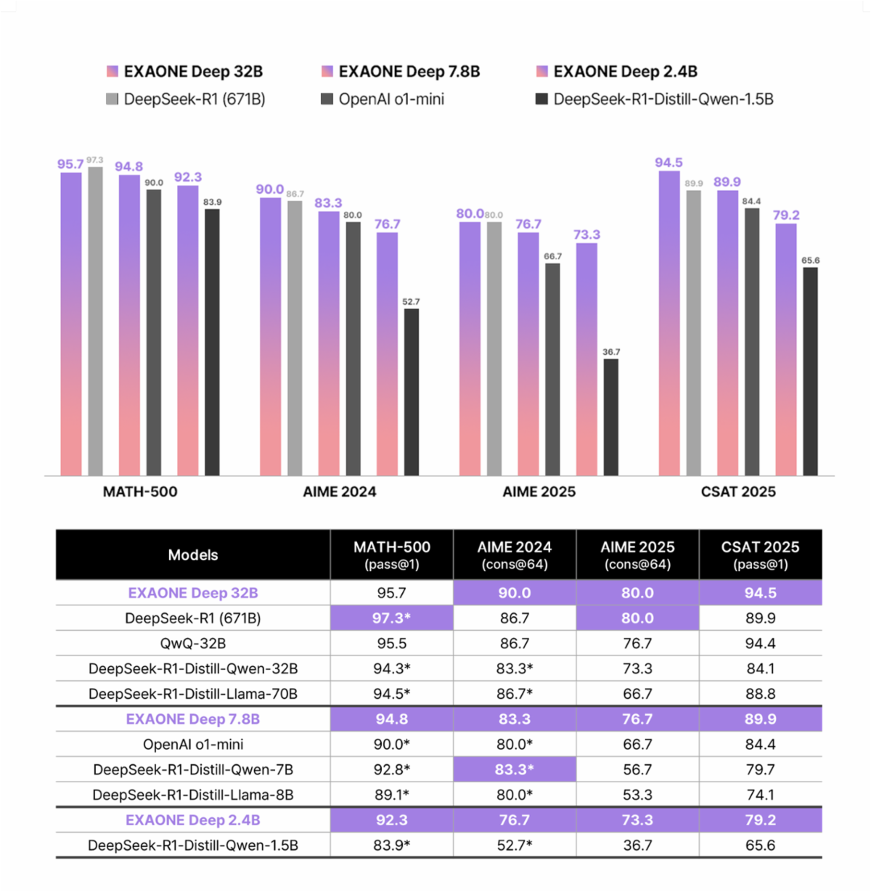
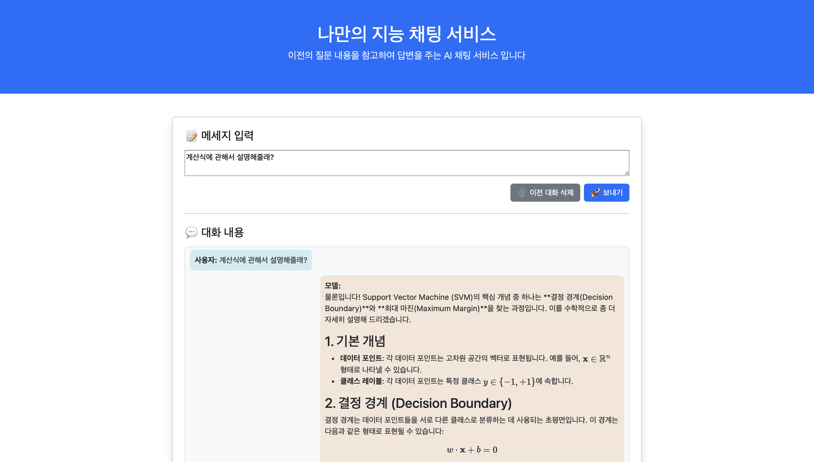

# sllmproject2025
캡스톤프로젝트2 과목 세번째 프로젝트, sLLM 만들어보기

---

# 나만의 챗봇 만들기

## 📌 개요

### 🔍 모델
- LGAI-EXAONE/EXAONE-3.5-2.4B-Instruct 모델 사용

### ❓프로젝트에 EXAONE 모델을 채택한 이유?
- **⚡ 가볍고, 빠르고, 🇰🇷 한국어에 적합한 모델.**
- 🔥 요즘 뜨는  Qwen, llama와 비교시 거의 비슷하거나, 소폭 우위

| Models              | MT-Bench | LiveBench | Arena-Hard | AlpacaEval | IFEval | KoMT-Bench[1] | LogicKor |
|---------------------|:--------:|:---------:|:----------:|:----------:|:------:|:-------------:|:--------:|
| **EXAONE 3.5 2.4B** | 7.81     | 33.0      | 48.2       | 37.1       | 73.6   | 7.24          | 8.51     |
| Qwen 2.5 3B         | 7.21     | 25.7      | 26.4       | 17.4       | 60.8   | 5.68          | 5.21     |
| Qwen 2.5 1.5B       | 5.72     | 19.2      | 10.6       | 8.4        | 40.7   | 3.87          | 3.60     |
| Llama 3.2 3B        | 6.94     | 24.0      | 14.2       | 18.7       | 70.1   | 3.16          | 2.86     |
| Gemma 2 2B          | 7.20     | 20.0      | 19.1       | 29.1       | 50.5   | 4.83          | 5.29     |

> **참고:**  
> - `KoMT-Bench[1]`은 한국어 평가 기준 벤치마크 점수입니다.  
> - 점수는 모두 클수록 좋은 성능을 의미합니다.

## ⚙️ 프로젝트 구성

- 🧩 **백엔드**: `FastAPI`  
- 🖥️ **프론트엔드**: `HTML` 기반 UI  

- **🧠 Generator 클래스**:  
  - ⚙️ **역할**: 사용자의 대화 이력을 바탕으로 자연스러운 답변을 생성하고, 그 내용을 요약해주는 핵심 모듈  
  - 🛠️ **핵심 기능**:  
    - 🧾 **맥락 인식 응답 생성** – 이전 대화 흐름을 이해하고 그에 맞는 답변 생성  
    - 📝 **요약 기능** – 생성된 응답을 다시 요약해, 3줄 이내의 핵심 내용 정리  
    - ⚡ **자동 디바이스 감지** – CUDA / MPS / CPU 환경 자동 인식 및 최적화  
    - 🧹 **리소스 정리** – 응답 생성 후 GPU 메모리 캐시 및 가비지 컬렉션 처리  

- 💬 **주요 기능**:  
  - 📝 사용자 질문 이력을 바탕으로 **맥락을 반영한 응답 생성**  
  - ✨ **요약 강조** 기능 및 **마크다운 기반 포맷팅**으로 가독성 높은 응답 제공  
  - 📐 **수학식 표현 지원**을 통해 학습 및 기술 질의에 활용 가능  
---

### 실행방법
1. `main.py` 실행 👉 서버 및 모델 로딩  
2. 브라우저에서 [http://127.0.0.1:8000](http://127.0.0.1:8000) 접속  
3. 실시간 AI 챗봇과 대화 시작!

---

### 결과물
> ### **❓SVM에 대한 질문을 했을떄 결과**  

> ### **❓ 계산식을 설명 해달라고(**맥락 기반 응답**) 질문 했을때 결과**   
  
#### 모델이 앞전의 대화 맥락(SVM에 관한 질문)을 이해하며, 계산식 관련된 표현이 정상적으로 출력됨을 확인할 수 있음.

---

### 개선점

| 항목 | 설명 |
|------|------|
| ⚠️ 지식 누락 / 부정확한 응답 | 3B 모델 특성상 특정 정보에 대해 부정확하거나 누락된 응답 발생 가능 예: "어느 대학교는 어디에 있어?" → 오답 가능성 |
| ⏳ 긴 응답 처리 | 긴 토큰 생성 시 응답이 지연되거나 중간에 잘릴 수 있음 |
| 🧠 LangChain 사용 | 맥락 기반 대화 성능 향상 가능 하지만 메모리 사용량이 높아 Toy 프로젝트에는 부담 |
| 👉 대화 기록 처리 방식 | LangChain 대신 프론트엔드에서 대화 기록을 구성해 백엔드로 전달하는 방식으로 전환 |
---

### ✅ 결론 및 마무리

- 💡 EXAONE-3.5-2.4B-Instruct 모델을 채택하면서, 한국어에 특화된 LLM을 직접 다뤄보고, 빠르고 정확한 응답을 구현하는 경험을 했습니다. 
- 🧠 Generator 클래스를 설계 및 구현하며, 맥락 기반 대화 처리와 자동 요약 기능의 중요성과 적용 방법을 깊이 이해하게 되었습니다. 
- 🌐 FastAPI와 HTML 기반 UI를 연동해 실시간 챗봇 인터페이스를 만들며, 백엔드와 프론트엔드 간 통신 흐름을 경험할 수 있었습니다. 
- 📊 여러 모델 성능 벤치마크를 비교 분석하면서, 모델 선택 기준과 실제 성능에 대한 판단력을 기를 수 있었습니다. 

-  💬 사용자 경험을 고려한 설계
   - 전 질문을 기억하고 이어서 자연스럽게 대화가 가능한 흐름을 구성하였고  마크다운 형식을 적용해 응답의 가독성과 정보 전달력을 높일 수 있었습니다.  또한 수학식과 다양한 형식도 자연스럽게 표현되도록 처리해 학습이나 질의응답에도 활용 가능한 챗봇을 완성할 수 있었습니다.

---
### reference
- LG-Ai: https://www.lgresearch.ai/blog/view?seq=541
- EXAONE Hugging Face : https://huggingface.co/LGAI-EXAONE/EXAONE-3.5-2.4B-Instruct
---
### License

The model is licensed under [EXAONE AI Model License Agreement 1.1 - NC](LICENSE.txt)
